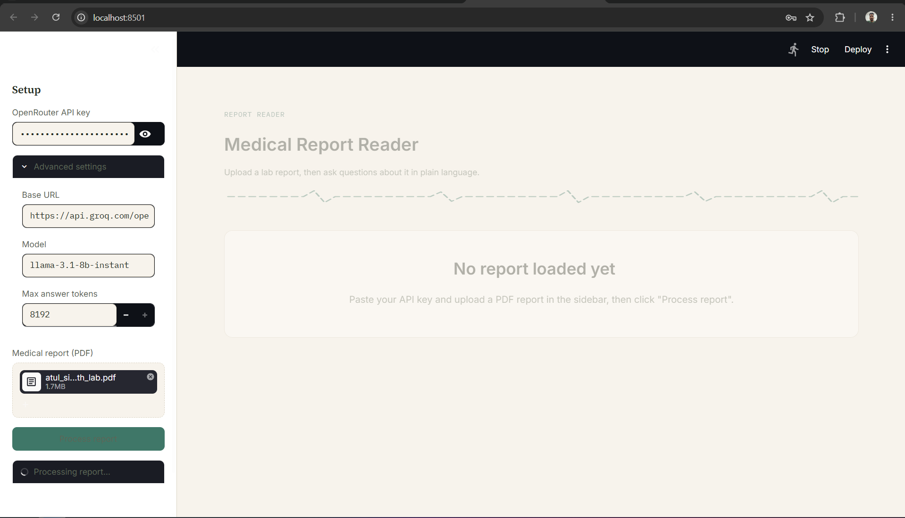
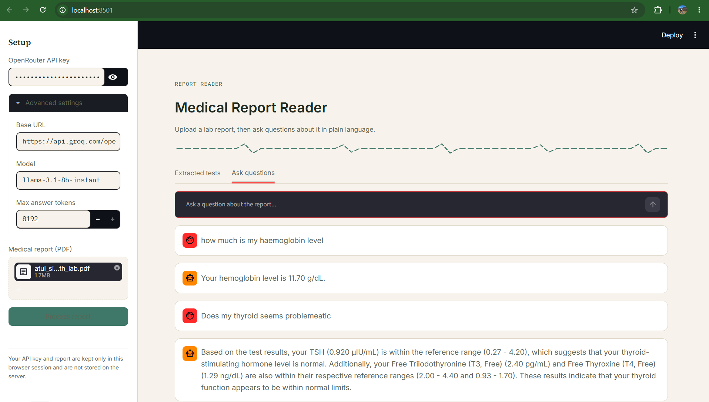

# 🩺 Medical Report Reader (RAG)

A tool that reads a medical lab report PDF, extracts every test into structured
data, and lets you ask plain-language questions about it — answered using
Retrieval-Augmented Generation (RAG) over your own report.

Available as both a **Streamlit web app** and a **PyQt5 desktop app**.

---

## 📸 Screenshots

<!--
Add your screenshots to a `screenshots/` folder in this repo, then reference
them below. Example:

  screenshots/
    setup.png
    extracted-tests.png
    chat.png

GitHub will render them automatically once pushed.
-->

| Setup | Extracted Tests | Ask Questions |
|---|---|---|
|  |  |  |

<!-- Replace the rows above with as many screenshots as you'd like, or add a single full-page screenshot here: -->
<!--  -->

---

## ✨ Features

- **Upload a PDF lab report** and extract every test (section, name, result, unit, reference range) automatically using an LLM.
- **Automatic range flagging** — each result is checked against its reference range and tagged "Within range" / "Out of range" / "Unknown".
- **Ask questions in plain English** ("Is my RBC count okay?", "What is AST?") and get answers grounded in your actual report via RAG (FAISS + HuggingFace embeddings + MMR retrieval).
- **Bring your own API key** — works with any OpenAI-compatible endpoint (OpenRouter, Groq, etc.). Your key and report data stay in your own session; nothing is persisted server-side.
- **Chunked extraction** for long, multi-page reports, so it works within free-tier rate limits.

---

## 🧱 Tech Stack

- **UI:** Streamlit (web) / PyQt5 (desktop)
- **PDF parsing:** pypdf
- **Orchestration:** LangChain
- **Embeddings:** `sentence-transformers/all-MiniLM-L6-v2` (HuggingFace)
- **Vector store:** FAISS
- **LLM access:** Any OpenAI-compatible API (OpenRouter, Groq, etc.)

---

## ⚙️ How It Works

```
PDF upload
   │
   ▼
Text extraction (pypdf)
   │
   ▼
LLM structures raw text → JSON (per chunk, to respect token limits)
   │
   ▼
LangChain Documents → chunked → embedded (FAISS vector store)
   │
   ▼
User question → MMR retrieval → relevant chunks → LLM answer
```

---

## 🚀 Getting Started

### 1. Clone the repo

```bash
git clone https://github.com/ShubhamPatwar/llm_report_reader.git
cd llm_report_reader
```

### 2. Install dependencies

```bash
pip install -r requirements_streamlit.txt
```

### 3. Run the app

```bash
streamlit run streamlit_app.py
```

The app opens at `http://localhost:8501`. Paste your API key and base URL into the sidebar — no `.env` file or hardcoded secrets needed.

---

## 🔑 API Configuration

In the sidebar, set:

| Field | Example |
|---|---|
| API key | Your provider's key (kept in-session only) |
| Base URL | `https://openrouter.ai/api/v1` or `https://api.groq.com/openai/v1` |
| Model | e.g. `llama-3.1-8b-instant`, `deepseek/deepseek-r1:free` |

Any OpenAI-compatible chat completions endpoint works.

---

## ☁️ Deployment

This app has been deployed on an AWS EC2 instance:

```bash
streamlit run streamlit_app.py --server.port 8501 --server.address 0.0.0.0
```

with port `8501` opened in the instance's security group. (For production use, put it behind a reverse proxy like nginx or Caddy for HTTPS, and run it as a systemd service so it survives reboots.)

---

## ⚠️ Disclaimer

This tool summarizes and explains report contents using an LLM. It is **not**
a medical device and does **not** provide medical advice or diagnosis.
Range-flagging is an automatic numeric check, not a clinical interpretation.
Always consult a qualified healthcare professional about your results.


